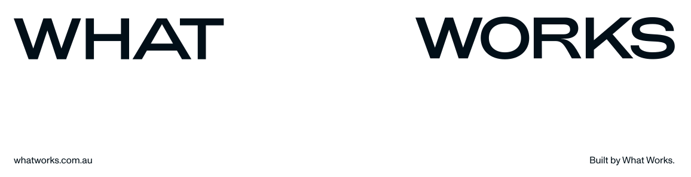

# Whatworks Payload Packages

<a href="https://whatworks.com.au" target="_blank" rel="noopener noreferrer">
  <picture>
    <source media="(prefers-color-scheme: dark)" srcset="./assets/blackbanner.svg">
    
  </picture>
</a>

&nbsp;

A monorepo of [Payload CMS](https://payloadcms.com) plugins, fields, and utilities published under the `@whatworks` scope.

## Packages

| Package | Description |
| --- | --- |
| [`@whatworks/payload-block-settings`](./packages/block-settings) | Hide extra fields for blocks behind a visibility toggle button. |
| [`@whatworks/payload-select-search-field`](./packages/select-search-field) | Server-backed search select field and plugin for Payload. |
| [`@whatworks/payload-utilities`](./packages/payload-utilities) | A collection of utilities for Payload 3.0. |
| [`@whatworks/analytics`](./packages/analytics) | Analytics components for Next.js with cookie consent. |
