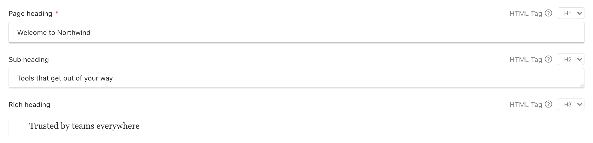
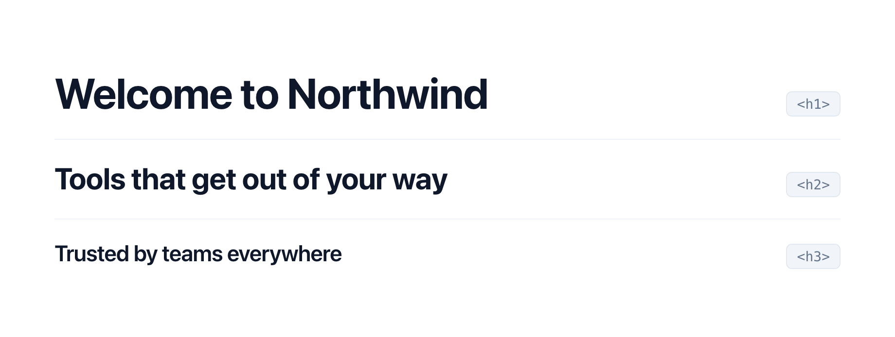

# Payload Heading Field

<a href="https://whatworks.com.au/?utm_source=github.com">
  <picture>
    <source media="(prefers-color-scheme: dark)" srcset="../../assets/blackbanner.svg">
    
  </picture>
</a>

&nbsp;

Let content editors choose the rendered heading tag (`h1`–`h6`) for any heading,
without leaving the field they're already editing. `headingField()` wraps a
`text`, `textarea`, or `richText` field in a group that also stores the chosen
tag, and renders it as a single, normal-looking field with a compact tag
dropdown sitting inline beside the field label.

## Demo

Editors pick the heading level inline, right where they write the heading — and
the front end renders the tag they chose.

**In the Payload admin**, every heading field gets a compact `HTML Tag` dropdown
beside its label. It works the same for `text`, `textarea`, and `richText`:



**On the front end**, render the stored value through `<RenderHeading>`:

```tsx
import { RenderHeading } from '@whatworks/payload-heading-field/rsc'

export default async function Page() {
  const page = await getPage()

  return (
    <>
      <RenderHeading data={page.heading} /> {/* editor picked H1 → <h1> */}
      <RenderHeading data={page.subheading} /> {/* editor picked H2 → <h2> */}
      <RenderHeading data={page.richHeading} render={(value) => <RichText data={value} />} />
    </>
  )
}
```

**What renders** — the emitted element matches the tag the editor chose, so the
page outline is theirs to control without touching code:



## Contents

- [Demo](#demo)
- [Installation](#installation)
- [Usage](#usage)
- [Arguments](#arguments)
- [Stored shape](#stored-shape)
- [Backwards compatibility](#backwards-compatibility)
- [Rendering on the front end](#rendering-on-the-front-end)
- [Notes](#notes)

## Installation

```bash
pnpm add @whatworks/payload-heading-field
```

The custom field component is referenced by string path, so run your import map
generation after adding a heading field:

```bash
payload generate:importmap
```

## Usage

Wrap an existing field object in `headingField()` — that's the whole change.
The field is the first argument, so adopting it in an existing codebase is a
one-line edit:

```ts
import { buildConfig } from 'payload'
import { lexicalEditor } from '@payloadcms/richtext-lexical'
import { headingField } from '@whatworks/payload-heading-field'

export default buildConfig({
  collections: [
    {
      slug: 'pages',
      fields: [
        // Just wrap the field — defaults to tags ['h1'–'h5'], default 'h2'.
        headingField({
          name: 'heading',
          type: 'text',
          label: 'Page heading',
          required: true,
        }),

        // Pass a second argument only when you want to override the defaults.
        // Works with textarea and richText values too.
        headingField(
          {
            name: 'intro',
            type: 'richText',
            editor: lexicalEditor(),
          },
          { tags: ['h2', 'h3', 'h4'], defaultTag: 'h3' },
        ),
      ],
    },
  ],
})
```

There is no plugin to register — `headingField()` returns a normal Payload field.

## Arguments

`headingField(field, config?)`

### `field` (required, first argument)

The field that captures the heading's value. Must be a named `TextField`,
`TextareaField`, or `RichTextField`. Pass your existing field object here — that
is the only change needed to adopt it. Its label drives the rendered field label;
its value is stored under `<name>.value`.

### `config` (optional, second argument)

| Key          | Type                                               | Default                          | Notes                                                                |
| ------------ | -------------------------------------------------- | -------------------------------- | -------------------------------------------------------------------- |
| `tags`       | `('h1' \| 'h2' \| 'h3' \| 'h4' \| 'h5' \| 'h6')[]` | `['h1', 'h2', 'h3', 'h4', 'h5']` | Tags offered in the inline dropdown, in display order.               |
| `defaultTag` | same union as above                                | `'h2'`                           | Pre-selected tag for new documents. Must be in `tags`.               |
| `tooltip`    | `string`                                           | content-editor explainer         | Text for the “(?)” tooltip beside the label. Overrides the built-in. |

`headingField()` throws if `defaultTag` is not included in `tags`, or if any tag
is outside `h1`–`h6`.

## Customising the label

The header (the label plus the tag dropdown) is rendered by a custom `Label`
component, so set one on the field exactly as you would for any Payload field —
`headingField()` lifts it up to the group so it renders in the header:

```ts
headingField({
  name: 'heading',
  type: 'text',
  admin: {
    components: {
      Label: './components/HeadingLabel#HeadingLabel',
    },
  },
})
```

A custom `Label` **replaces the entire header**, so it owns the layout. Two
building blocks are exported so you can reconstruct it however you like:

- **`HeadingTagSelect`** — the tag dropdown.
- **`HeadingTagTooltip`** — the muted “— HTML Tag (?)” indicator (styled like
  Payload's localized-field indicator) with a simple CSS tooltip on the “(?)”.

Inside a heading field both need no props — `HeadingTagSelect` reads the path,
tags and read-only state from context:

```tsx
'use client'

import { HeadingTagSelect, HeadingTagTooltip } from '@whatworks/payload-heading-field/client'

export function HeadingLabel({ label }: { label: string }) {
  return (
    <div style={{ alignItems: 'center', display: 'flex', gap: '0.5rem' }}>
      <span>{label}</span>
      <HeadingTagTooltip tooltip="Pick the heading level for SEO and outline." />
      <HeadingTagSelect />
    </div>
  )
}
```

Other slots (`Description`, `BeforeInput`, `AfterInput`, a custom value `Field`)
stay with the value field and render around the input as usual. Omitting the
`Label` keeps the built-in header (label + tooltip + dropdown).

`HeadingTagTooltip` accepts `label`, `tooltip`, and `hideSeparator` props;
`HeadingTagSelect` accepts explicit `path` and `tags` props for use outside a
heading field.

> Because the label is resolved at the group's path, a custom `Label` receives
> the group's props — not the value field's. If you need the value field's
> `required` or `localized` (e.g. to render the required asterisk), set them
> directly in your custom component; the built-in fallback handles them for you.

## Stored shape

The field is stored as a group named after `field.name`:

```jsonc
{
  "heading": {
    "tag": "h2",
    "value": "Welcome", // string for text/textarea, Lexical state for richText
  },
}
```

## Backwards compatibility

`headingField()` is a drop-in replacement for a plain `text`, `textarea`, or
`richText` field. Wrapping an existing field changes its stored shape — the raw
value moves from `field.name` down to `field.name.value` — but documents saved
before the wrap keep loading without error or data loss.

```ts
// Before
{ name: 'richHeading', type: 'richText', editor: lexicalEditor() }

// After — wrap the same field object; existing `richHeading` documents still load fine
headingField({ name: 'richHeading', type: 'richText', editor: lexicalEditor() })
```

The generated group carries `afterRead` and `beforeValidate` hooks that coerce a
legacy value (a bare string, or a Lexical editor state like `{ root }`) into
`{ tag, value }`, using the configured `defaultTag`. Reads return the canonical
shape, and saving a migrated document persists it — so the migration happens
lazily, document by document, as content is edited. Values already in
`{ tag, value }` shape are never re-wrapped.

To migrate eagerly instead of waiting for edits, the same coercion is exported as
`normalizeHeadingValue(value, defaultTag)` for use in a script or Payload
migration:

```ts
import { normalizeHeadingValue } from '@whatworks/payload-heading-field'

const { docs } = await payload.find({ collection: 'pages', limit: 0 })

for (const doc of docs) {
  await payload.update({
    collection: 'pages',
    id: doc.id,
    data: { richHeading: normalizeHeadingValue(doc.richHeading, 'h2') },
  })
}
```

## Rendering on the front end

A small, framework-agnostic `RenderHeading` component is provided from the `/rsc`
entry point (safe to use in React Server Components). It renders the chosen tag,
spreads any extra HTML attributes (`className`, `id`, `style`, …) onto it, and
renders nothing when there is no resolvable content — so you never ship an empty
heading. It handles plain string values out of the box; for rich text, supply a
converter via `render` or pre-rendered nodes via `children`.

> It's deliberately named `RenderHeading`, not `Heading`, so the short name stays
> free for your own component — most apps wrap it (see below) and call the wrapper
> `Heading`.

> This component is an intentionally minimal starting point — rich text
> converters are app-specific, so the wiring is left to you.

```tsx
import { RenderHeading } from '@whatworks/payload-heading-field/rsc'

// text / textarea
;<RenderHeading data={page.heading} className="display" />

// richText (bring your own Lexical → JSX converter)
;<RenderHeading data={page.intro} render={(value) => <RichText data={value} />} />
```

It accepts Payload's generated types directly — `data` is partial, so optional
`value` (or a whole optional group) on a non-required field is fine. It is also
generic over the value type, so the `render` argument is typed from `data` with
no cast.

### Wrapping `RenderHeading`

Most apps have a single Lexical → JSX converter, so rather than passing `render`
at every call site, wrap `RenderHeading` once to inject it. Type the wrapper to
the value it renders and the `render` argument is fully typed. Since the library
export is `RenderHeading`, you're free to call your wrapper `Heading`:

```tsx
import { RenderHeading, type RenderHeadingProps } from '@whatworks/payload-heading-field/rsc'
import type { SerializedEditorState } from '@payloadcms/richtext-lexical/lexical'

import { RichText } from '@/components/RichText'

export function Heading(props: RenderHeadingProps<SerializedEditorState>) {
  // `value` is SerializedEditorState here — no cast. Callers can still override
  // `render`/`children`, and `data`, `className`, etc. forward through.
  return <RenderHeading render={(value) => <RichText data={value} />} {...props} />
}
```

Because `render` only runs once `data` is present, the converter never has to
guard against a missing value. Plain string headings need no wrapper — use
`RenderHeading` directly.

## Notes

- The group is always rendered through a custom Field component, so it never
  appears as a default Payload group in the admin UI.
- The `tag` sub-field is required and always carries a default, so it is never
  empty.
- Use `headingFieldMatches(field)` and `getHeadingTags(field)` (exported from the
  package root) if you need to detect or introspect heading fields elsewhere.
