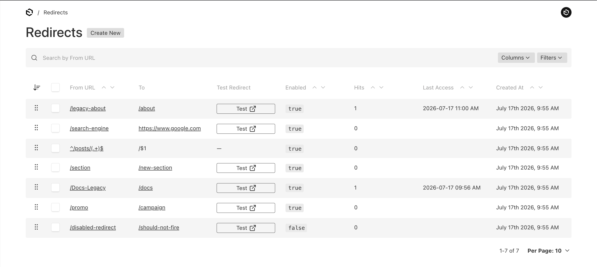
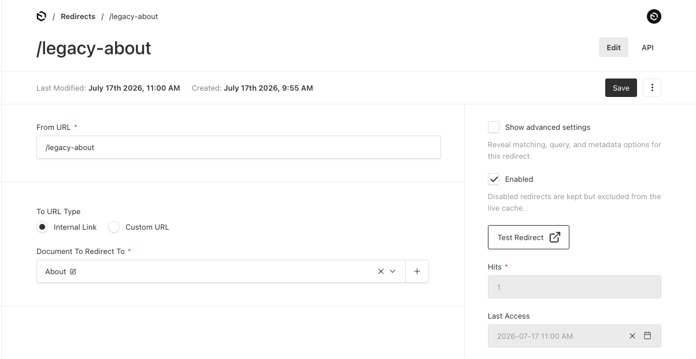
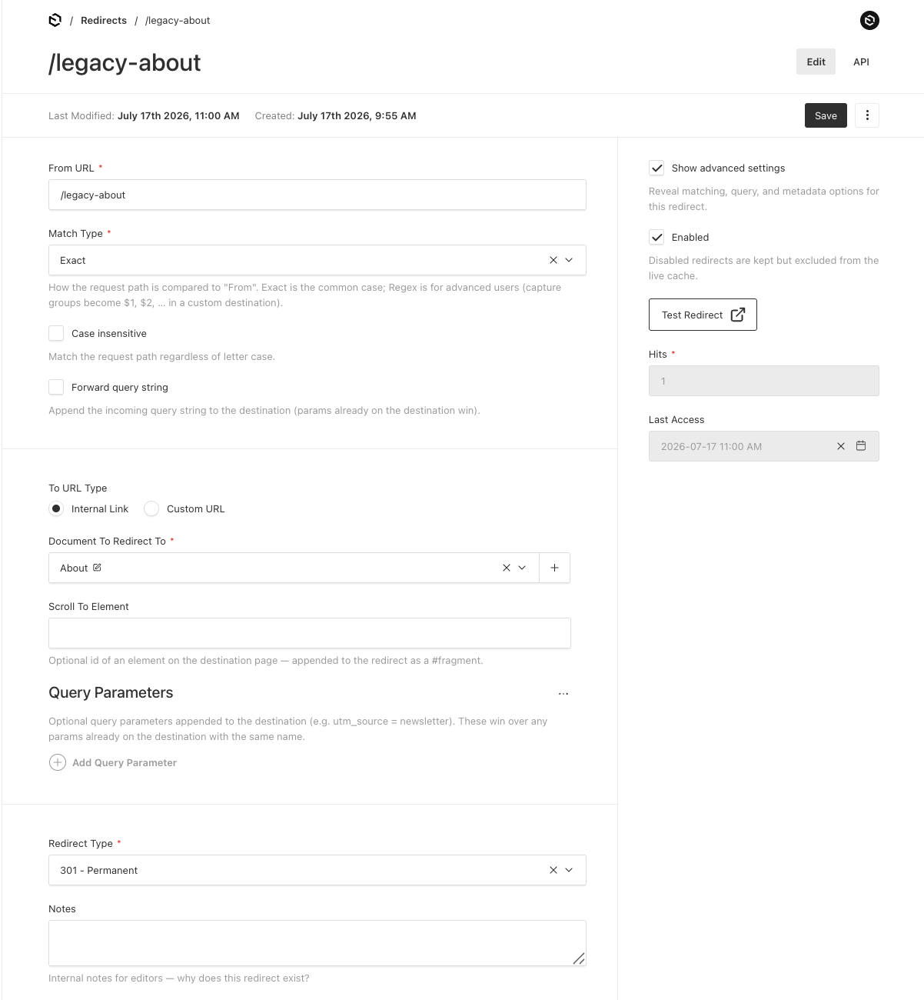

# @whatworks/payload-redirects

<a href="https://whatworks.com.au/?utm_source=github.com">
  <picture>
    <source media="(prefers-color-scheme: dark)" srcset="../../assets/blackbanner.svg">
    
  </picture>
</a>

&nbsp;

Managed redirects for [Payload](https://payloadcms.com) with a cache-backed [Next.js](https://nextjs.org) middleware matcher.

Editors manage redirects in an orderable admin collection; the plugin denormalizes them into a shared cache on every change; your `proxy.ts`/`middleware.ts` answers matching requests straight from that cache — no Payload import, no database query, no function invocation on the hot path. The serving side is framework-agnostic — a WHATWG-only resolver / request handler (`@whatworks/payload-redirects/resolver`) carries the same behavior to Hono, Cloudflare Workers, Astro, SvelteKit, Express, or anything else, and a pure `resolveRedirect` sits underneath for full manual control.

- **Simple by default, powerful when needed** — the editor form shows just `From`, `To`, and `Enabled`; a "Show advanced settings" toggle reveals match type, case-insensitivity, query forwarding, redirect type, scroll-to anchor, and notes.
- **Match types** — exact (default), starts with, ends with, contains, or regex with capture-group substitution (`^/blog/(.+)$` → `/news/$1`).
- **Internal or custom destinations** — point a redirect at a document (resolved to its path, kept in sync when the doc moves or is deleted) or at any URL/pathname.
- **Query forwarding & case-insensitivity** — opt-in per redirect.
- **Loop-safe** — save-time loop/self-redirect validation, and build-time chain flattening so visitors take a single hop.
- **Test in place** — a "Test Redirect" button on the edit form and a "Test Redirect" column in the list view open a redirect's `From` URL in a new tab.
- **Hit tracking** — per-redirect counter and last-access timestamp, updated in the background with adapter-agnostic optimistic concurrency.
- **Pluggable cache** — Vercel Runtime Cache, Vercel Edge Config, Redis (ioredis / node-redis / Upstash), Cloudflare KV, JSON file, in-memory, or your own adapter.
- **Localization & migration** — per-locale caches, and a one-shot helper to migrate from `@payloadcms/plugin-redirects`.

## Demo

Manage redirects from an orderable collection in the Payload admin, with quick testing and hit tracking:



Create simple redirects with an internal document or custom URL destination:



Reveal advanced matching, query, anchor, redirect type, and notes settings when needed:



## Install

```sh
pnpm add @whatworks/payload-redirects
# Only if you use the Vercel Runtime Cache adapter:
pnpm add @vercel/functions
# Only if you use the Vercel Edge Config adapter:
pnpm add @vercel/edge-config
```

`next`, `@vercel/functions`, and `@vercel/edge-config` are optional peer dependencies — install only what your chosen cache and matcher need.

## Quick start

Define the shared config once, in a module imported by **both** your Payload config and your middleware. `defineRedirectsConfig` bundles the `cache` (and any `endpointsPath`, `secret`, or `api`) so the two sides can never drift — spread it into the plugin, and pass it straight to the middleware. The plugin writes to the cache, the middleware reads from it, so both must share one backing store:

```ts
// redirects.config.ts
import { envCache, fileCache } from '@whatworks/payload-redirects/cache'
import { defineRedirectsConfig } from '@whatworks/payload-redirects/middleware'
import { vercelRuntimeCache } from '@whatworks/payload-redirects/vercel'

// The Vercel Runtime Cache only exists on Vercel's infrastructure, so `envCache`
// falls back to a JSON file cache (.next/cache/payload-redirects.json) locally —
// which is what makes `next dev` work. See "Development fallback" below.
export const redirectsConfig = defineRedirectsConfig({
  cache: envCache({
    development: fileCache(),
    production: vercelRuntimeCache(),
  }),
})
```

```ts
// payload.config.ts
import { redirectsPlugin } from '@whatworks/payload-redirects'
import { redirectsConfig } from './redirects.config'

export default buildConfig({
  plugins: [
    redirectsPlugin({
      ...redirectsConfig, // cache, endpointsPath, secret — `api` is ignored here
      collections: {
        // Collections editors can pick as internal destinations, and how a
        // referenced doc resolves to the path it lives at.
        pages: { path: ({ doc }) => (doc.slug === 'home' ? '/' : `/${doc.slug}`) },
      },
    }),
  ],
})
```

```ts
// proxy.ts (Next 16) — or middleware.ts with the nodejs runtime
import type { NextFetchEvent, NextRequest } from 'next/server'
import { createRedirectsMiddleware } from '@whatworks/payload-redirects/middleware'
import { NextResponse } from 'next/server'
import { redirectsConfig } from './redirects.config'

const redirects = createRedirectsMiddleware(redirectsConfig)

export default async function proxy(request: NextRequest, event: NextFetchEvent) {
  return (await redirects(request, event)) ?? NextResponse.next()
}
```

> `defineRedirectsConfig` is exported from the main entry and from `/resolver` and `/middleware`. Import it from an **edge-safe** entry (`/middleware` above, or `/resolver`) whenever the shared module is also pulled into edge middleware — that keeps `payload` out of the middleware bundle.

## How it works

The plugin adds an orderable `redirects` collection. Every create/update/delete/reorder rebuilds the full redirect list — normalized `from`, resolved destination, `queryParams` and `scrollTo` fragment applied, flags denormalized — and writes it to the cache in one entry. Collections configured as destinations get hooks too: when a published document's path changes (or it is deleted), the cache is rebuilt so resolved destinations never go stale. Draft saves never touch the cache.

The middleware reads the list per request, matches in admin drag order (first match wins), and issues the redirect. On a cache miss it returns `undefined` immediately and refreshes the cache in the background via the plugin's `refresh-cache` endpoint (`event.waitUntil`), so a cold cache costs one pass-through request, never latency. A broken cache backend never takes down routing — errors read as "no redirects".

## The redirects collection

The editor form is deliberately minimal. By default only three controls show:

- **From URL** — what the request is matched against. For exact matches, a pathname (`/old`, trailing slashes collapsed) or absolute URL (reduced to its path + query). Unique (per locale when localized), indexed, validated.
- **To** — an internal document reference (when `collections` are configured) or a custom URL/pathname.
- **Enabled** (sidebar) — disabled redirects are kept in the collection but excluded from the live cache, so they never fire. Toggle a redirect off instead of deleting it.
- **Test Redirect** (sidebar) — opens the redirect's `From` URL in a new tab so you can confirm it fires. It reads the value currently in the field, so save first if you want to test an edit. Disabled when `From` isn't a concrete URL to open — a regex pattern, or a `contains`/`endsWith` fragment that isn't a path. Root-relative paths open against the admin's own origin. The list view carries the same action as a **Test Redirect** column.

Flip **Show advanced settings** (sidebar) to reveal:

- **Match Type** — `exact` (default) · `startsWith` · `endsWith` · `contains` · `regex`. Exact is the common case; regex is for advanced users, and capture groups substitute into a custom destination URL as `$1`, `$2`, … (unmatched groups become empty strings). Only regex supports substitution — the other types have a fixed destination. This replaces the old `useRegex` checkbox entirely.
- **Case insensitive** — match the request path regardless of letter case (regex uses the `i` flag).
- **Forward query string** — append the incoming query to the destination; params already present on the destination win.
- **Redirect Type** — `301` permanent (default) or `302` temporary. Also shown automatically whenever a redirect is already set to `302`.
- **Scroll To Element** — optional element id appended to the destination as `#fragment` (a leading `#` is tolerated; it replaces any fragment a custom URL already carries).
- **Query Parameters** — an optional list of `name` / `value` rows appended to the destination's query string (e.g. `utm_source` = `newsletter`). Names and values are URL-encoded for you; a row wins over a param already on the destination with the same name. Any fragment (from **Scroll To Element** or a custom URL) is preserved after the query.
- **Notes** — free-text, editor-facing ("why does this redirect exist?").

Advanced-gated fields stay visible for any redirect that already holds a non-default value, so a redirect configured through the toggle keeps showing its options even after the toggle is turned off.

Rows are drag-orderable; earlier rows win when several match. Redirects that cannot produce a working redirect (unresolvable reference, empty destination, unparseable `from`) are dropped from the cache rather than cached broken.

### Match-type & regex safety

Regex patterns are validated at save time (this is a conservative static check, not a runtime ReDoS guard — exotic patterns may need restructuring). The validator rejects:

- patterns that don't compile, or are longer than 256 characters;
- backreferences (`\1`–`\9`);
- nested unbounded quantifiers — an unbounded quantifier (`*`, `+`, `{n,}`) wrapping a group that itself repeats unboundedly, i.e. the classic catastrophic-backtracking shape `(a+)+`;
- bounded repetition with a maximum above 1000.

`validateSafeRegexPattern`, `validateFromField`, `validateUrlOrPathname`, `validateScrollTo`, and `validateQueryParamKey` are exported if you build your own fields.

### Canonicalization

Exact `from` values (and the request targets they're compared against) are canonicalized with identical logic so equivalent URLs match:

- absolute URLs are reduced to `path(+search)`, and trailing slashes are collapsed;
- query strings are sorted by key (stable for repeated keys), so `?b=2&a=1` ≡ `?a=1&b=2`;
- raw unicode is percent-encoded and all `%xx` escapes are upper-cased.

Case is **preserved** during canonicalization — case-insensitivity is a per-redirect match-time concern. Non-exact match types (starts with / ends with / contains / regex) are only trimmed, never canonicalized, since stripping a trailing slash would break the intent of a substring or pattern. The matcher tries `path?search` first (most specific), then the bare path, so `/old` still matches `/old/?utm_source=x`.

### Loops & chains

- **Save time** — creating or editing an exact redirect with a custom relative destination is checked against the graph of existing enabled exact redirects; a direct self-redirect, or a chain that leads back to the redirect's own `from` within 20 hops, is rejected with a `ValidationError` that spells out the chain. (Reference destinations and non-exact match types are out of scope.)
- **Build time** — when the cache is built, each entry's destination is followed through exact entries (up to 10 hops) and collapsed, so `/a → /b` + `/b → /c` is cached as `/a → /c` and visitors take a single hop. A cycle is logged and left unflattened rather than cached broken. The earliest `scrollTo` fragment in the chain is carried onto the final destination.

## Plugin options

```ts
redirectsPlugin({
  cache, // required — see "Cache adapters"
  collections: {
    // internal-destination collections (omit for custom URLs only)
    pages: {
      path: ({ doc, locale, req }) => string | null | undefined,
      // Runs at cache-build time with the referenced doc populated one level
      // deep. Return null/undefined (or throw) to drop redirects pointing at
      // this doc. `locale` is passed when the plugin is localized.
      select: { slug: true, title: true }, // optional — see below
    },
  },
  slug: 'redirects', // collection slug
  endpointsPath: '/payload-redirects', // REST base path (must match the middleware option)
  trackHits: true, // hit counter + lastAccess fields and the hit endpoint
  localized: false, // localize `from` and `to`; build one cache per locale
  syncOnInit: true, // rebuild the cache from the database once on boot (onInit)
  secret: process.env.REDIRECTS_SECRET, // lock down the endpoints — see "Security"
  disabled: false, // keep the collection (schema parity) but disable everything else
  overrides: ({ collection }) => collection, // final say over the generated collection
})
```

- **`select`** (per destination collection) narrows the fields populated on that collection during a cache rebuild — passed to the redirects `find` as `populate: { [slug]: select }`, so depth-1 population fetches only what your `path()` needs. Defaults to full population.
- **`localized`** localizes `from` and the `to` group, and builds the cache once per configured locale (each cache entry carries its `locale`). Requires `localization` on the Payload config — if absent, the plugin logs a warning and behaves as `false`. Rows with no `from` for a given locale are skipped for that locale. Unique `from` is scoped per locale.
- **`syncOnInit`** rebuilds the cache from the database once on boot, composing any existing `onInit` (yours runs first). A freshly started instance then serves redirects without waiting for the first content change or cache-miss refresh. A sync failure is logged, never fatal. Set `false` to opt out; skipped entirely when `disabled`.
- **`api`** comes from the shared config but is **ignored by the plugin** — it only concerns the middleware/resolver. Spreading `redirectsConfig` into both sides is safe.

`syncRedirectsCache(payload, req?)` is exported for priming the cache from seed scripts; `getRedirectsConfig(config)` returns the resolved plugin config from a Payload config.

### Security (endpoint hardening)

By default the `refresh-cache` and `hit/:id` endpoints are open (zero-config — the middleware calls them itself, and they only rewrite the cache or bump a counter from existing data). Set a `secret` to lock them down: both endpoints then require either an authenticated `req.user` or the `x-payload-redirects-secret` header equal to that value; unauthorized requests get a `403`. Give the middleware the same `secret` and it sends the header on its background refresh and hit-tracking requests. When `NODE_ENV === 'production'` and no `secret` is set, the plugin logs a one-time warning on boot that the endpoints are publicly reachable.

### Hit tracking

With `trackHits: true` (default), each match reports to `POST /hit/:id` in the background. The write uses adapter-agnostic optimistic concurrency: it reads the current count, then issues a guarded update conditioned on that value, retrying up to three times on a lost race before a best-effort unguarded write. Same-id writes are also serialized per process. It's designed to be as close to atomic as the database API allows — accurate enough for analytics, not accounting.

## Middleware options

```ts
createRedirectsMiddleware({
  cache, // required — same backing store as the plugin
  api: '/api', // Payload REST base: relative path (default) or absolute URL — see below
  endpointsPath: '/payload-redirects',
  trackHits: true, // report matches to the hit endpoint (disable with trackHits: false)
  refreshOnMiss: true, // rebuild the cache in the background on a miss
  secret: process.env.REDIRECTS_SECRET, // sent as x-payload-redirects-secret on background calls
  debug: false, // console.debug('[payload-redirects] …') for misses, matches, skips
  trailingSlash: false, // match your next.config trailingSlash: true
  cacheMemoMs: undefined, // in-memory memo of the cache read + compiled regexes
  onRedirect: ({ destination, redirect, request }) => {
    // Called for every issued redirect via event.waitUntil when available, else
    // fire-and-forget. Errors are swallowed — a failing hook never breaks routing.
  },
})
```

- **`api`** — base of the Payload REST API the background refresh and hit-tracking calls target. A **relative path** (default `/api`) is resolved against each request's own origin and, in an app with a `basePath`, prefixed with it automatically — so keep it `/api`, not `/<basePath>/api`. An **absolute URL** (`https://cms.example.com/api`) is used verbatim, for split-origin deployments (see below), and is never `basePath`-prefixed.
- **`cacheMemoMs`** — micro-memo (per middleware instance) of the last successful cache read and its compiled per-entry regexes, so bursts of requests don't each hit the backing store or recompile patterns. Defaults to `5000` when `NODE_ENV === 'production'`, otherwise `0` (off). A miss is never memoized, so a background refresh is picked up on the very next request.
- **`debug`** — opt-in diagnostics for cache misses, matches (`from → destination` + status), open-redirect rejections, and self-redirect skips. Never logs request bodies.
- **`trailingSlash`** — set to `true` when your `next.config` uses `trailingSlash: true`. Relative destinations then get a trailing slash on the path part (`/about` → `/about/`), so we redirect straight to the canonical URL instead of letting Next 308 the slashless one — a wasteful double hop. The slash is skipped when the path is `/`, already ends with `/`, or its last segment looks like a file (`/logo.png`), mirroring Next's own exemption; query and fragment are preserved (`/a?x=1#f` → `/a/?x=1#f`). Absolute/external destinations are never touched. Not auto-detected — `NextRequest` exposes no reliable view of the app's `trailingSlash` config — so set it explicitly.
- **`onRedirect`** — a side-effect hook (custom analytics, logging) that runs off the hot path.

The returned function takes `(request, event?)` and resolves to a `NextResponse` redirect or `undefined`. Background work runs through `event.waitUntil` when an event is passed.

### Next.js `basePath`

Apps with a [`basePath`](https://nextjs.org/docs/app/api-reference/config/next-config-js/basePath) just work — no configuration needed. Redirect entries are authored **without** the basePath (`/old`, not `/base/old`): matching runs against the basePath-stripped request path, and the basePath is re-applied to relative destinations, so `/base/old` → `/base/new`. Absolute/external destinations are left as-is. The background refresh and hit-tracking calls also target the basePath-prefixed Payload API, so leave `api` as its plain relative value (e.g. `/api`) — the basePath is prepended for you.

## Other frameworks

The Next.js middleware is a thin wrapper over a framework-agnostic core exported from `@whatworks/payload-redirects/resolver`. That core speaks only WHATWG APIs (`fetch`, `URL`, `Request`, `Response`) and imports no `payload`, `next`, or Node built-ins, so it stays bundleable on any edge/worker runtime. It carries **the same operational behavior as the middleware** — memoized cache reads, ordered matching, `forwardQuery`, `trailingSlash`, background cache-refresh on a miss, hit tracking, the `secret` header, and `debug` logging — so any runtime serves redirects identically. Two factories:

- **`createRedirectsResolver(options)`** → `(url, ctx?) => Promise<{ destination, redirect, status } | null>`. `destination` is relative or absolute exactly as resolved (after `forwardQuery`/`trailingSlash`); you absolutize and respond however your framework does. `url` is a `string | URL`.
- **`createRedirectsRequestHandler(options)`** → `(request, ctx?) => Promise<Response | null>`. Answers a WHATWG `Request` with a `Response.redirect` (relative destinations absolutized against `request.url`), or `null` to pass through.

Pass `ctx.waitUntil` (Vercel/Cloudflare `waitUntil`, Next's `event.waitUntil`, …) to anchor the background refresh / hit-tracking work; without it, that work runs fire-and-forget. Both factories accept the same options as the middleware **minus the Next-only `basePath` behavior**: `cache` (required), `api`, `endpointsPath`, `secret`, `trackHits`, `refreshOnMiss`, `trailingSlash`, `cacheMemoMs`, `debug`, and `onRedirect({ destination, redirect, url })`.

### Split-origin deployments (an absolute `api`)

By default the background refresh and hit-tracking calls target the request's own origin (`<origin><api><endpointsPath>/…`, with a relative `api`). When the CMS runs on a **different origin** than the app serving redirects, set `api` to the absolute Payload API base (no trailing slash) — those calls then go there instead, ignoring the request origin:

```ts
createRedirectsRequestHandler({ cache, api: 'https://cms.example.com/api' })
// → refresh: https://cms.example.com/api/payload-redirects/refresh-cache
```

The Next.js middleware treats an absolute `api` the same way (it then skips the `basePath` prefix on endpoint URLs).

> `fileCache`'s default path is `.next/cache/payload-redirects.json`, a Next convention — non-Next apps should pass an explicit `path` (e.g. `fileCache({ path: '.cache/payload-redirects.json' })`).

### Recipes

```ts
// Hono
import { createRedirectsRequestHandler } from '@whatworks/payload-redirects/resolver'
import { cache } from './redirects-cache'

const redirects = createRedirectsRequestHandler({ cache })

app.use(async (c, next) => {
  const response = await redirects(c.req.raw, c.executionCtx)
  return response ?? next()
})
```

```ts
// Cloudflare Workers
import { cloudflareKVCache } from '@whatworks/payload-redirects/cache'
import { createRedirectsRequestHandler } from '@whatworks/payload-redirects/resolver'

let redirects // module scope persists across requests, keeping the cache memo warm

export default {
  async fetch(request, env, ctx) {
    redirects ??= createRedirectsRequestHandler({
      cache: cloudflareKVCache({ namespace: env.REDIRECTS }),
    })
    return (await redirects(request, ctx)) ?? fetch(request)
  },
}
```

```ts
// Astro — src/middleware.ts
import { createRedirectsRequestHandler } from '@whatworks/payload-redirects/resolver'
import { defineMiddleware } from 'astro:middleware'
import { cache } from './redirects-cache'

const redirects = createRedirectsRequestHandler({ cache })

export const onRequest = defineMiddleware(async (context, next) => {
  return (await redirects(context.request)) ?? next()
})
```

```ts
// SvelteKit — src/hooks.server.ts
import { createRedirectsRequestHandler } from '@whatworks/payload-redirects/resolver'
import { cache } from './redirects-cache'

const redirects = createRedirectsRequestHandler({ cache })

export const handle = async ({ event, resolve }) =>
  (await redirects(event.request)) ?? resolve(event)
```

```ts
// Express — the resolver with Node req/res
import { createRedirectsResolver } from '@whatworks/payload-redirects/resolver'
import { cache } from './redirects-cache'

const resolve = createRedirectsResolver({ cache })

app.use(async (req, res, next) => {
  const url = new URL(req.originalUrl, `${req.protocol}://${req.get('host')}`)
  const result = await resolve(url)
  return result ? res.redirect(result.status, result.destination) : next()
})
```

### The pure matcher (`resolveRedirect`)

Under the resolver sits `resolveRedirect`, which is pure and dependency-free — reach for it when you want full manual control (custom hit reporting, no background fetch). It owns ordered matching, the self-redirect skip (fragments ignored, since they never reach the server), and the **open-redirect guard**: when a stored `to` is relative, the final destination (after regex substitution) must be a plain absolute path — it may not begin with `//` or `/\`, which browsers treat as protocol-relative URLs to another origin. `forwardQuery` is applied separately (it needs the full request URL), via the exported `mergeForwardedQuery`.

```ts
import { mergeForwardedQuery, resolveRedirect } from '@whatworks/payload-redirects'
import { cache } from './redirects-cache'

const entries = await cache.get()
const resolved = entries && resolveRedirect(entries, req.url)
if (resolved) {
  const { redirect } = resolved
  const destination = redirect.forwardQuery
    ? mergeForwardedQuery(resolved.destination, new URL(req.url, 'http://x').search)
    : resolved.destination
  // respond with a `redirect.status` (301/302) redirect to `destination`, report the hit yourself
}
```

`resolveRedirect(redirects, url, options?)` accepts a `string | URL` and returns `{ destination, redirect } | null`. Its optional `options.onSkip({ destination, reason, redirect })` fires for every **matched** entry that a guard then skips (`reason` is `'open-redirect'` or `'self-redirect'`), so you can answer "why didn't my redirect fire?" without re-implementing the guards; plain non-matches never fire it. The resolver and middleware wire `onSkip` to their `debug` logging. Report hits yourself with `POST {api}{endpointsPath}/hit/:id` if you want the counter.

## Cache adapters

A cache is just:

```ts
interface RedirectsCache {
  get: () => Promise<CachedRedirect[] | null> // null = miss
  set: (redirects: CachedRedirect[]) => Promise<void>
}
```

| Adapter                        | Import                                     | Use                                                                                                                                                                            |
| ------------------------------ | ------------------------------------------ | ------------------------------------------------------------------------------------------------------------------------------------------------------------------------------ |
| `vercelRuntimeCache(options?)` | `@whatworks/payload-redirects/vercel`      | Vercel deployments. Region-shared runtime cache, readable from middleware. Only exists on Vercel — wrap it with `envCache` for a local `next dev` fallback.                    |
| `edgeConfigCache(options)`     | `@whatworks/payload-redirects/edge-config` | Vercel deployments wanting the lowest-latency read path — see below. Reads via `@vercel/edge-config`; writes go through the Vercel REST API. Wrap with `envCache` for dev.     |
| `redisCache(options)`          | `@whatworks/payload-redirects/cache`       | Any Redis — ioredis, node-redis v4, or `@upstash/redis`. Pass your existing client; no dependency is added.                                                                    |
| `cloudflareKVCache(options)`   | `@whatworks/payload-redirects/cache`       | Cloudflare Workers/Pages. Pass the KV namespace binding.                                                                                                                       |
| `fileCache({ path? })`         | `@whatworks/payload-redirects/cache`       | Development and single-server self-hosting. Atomic JSON file writes; bridges the separate module graphs `next dev` runs the middleware and server in. Requires a Node runtime. |
| `memoryCache()`                | `@whatworks/payload-redirects/cache`       | Tests, or a single long-lived process serving both sides. Writes are invisible across processes — not for serverless or `next dev`.                                            |
| `envCache(options)`            | `@whatworks/payload-redirects/cache`       | Not a store — composes two caches and picks one per environment (e.g. file cache in dev, runtime/edge cache in prod). See "Development fallback".                              |

Any object with `get`/`set` works as an adapter — plug in your own store.

### Development fallback (`envCache`)

Cloud read paths like the Vercel Runtime Cache and Edge Config don't exist on your machine, so a `next dev` session needs a local stand-in (typically a `fileCache()`, which bridges the separate module graphs `next dev` runs the proxy and server in). `envCache` makes that fallback **explicit at the call site** — it composes two caches and selects one **once, at construction**:

```ts
import { envCache, fileCache } from '@whatworks/payload-redirects/cache'
import { vercelRuntimeCache } from '@whatworks/payload-redirects/vercel'

export const cache = envCache({
  development: fileCache(), // default when omitted; used when select() → 'development'
  production: vercelRuntimeCache(), // used when select() → 'production'
})
```

Previously each Vercel adapter carried a hidden `development` option and silently swapped stores based on `NODE_ENV`. `envCache` replaces that: the fallback lives where you define the cache, not inside the adapter.

- **Lazy branches** — pass a branch as a thunk and it's only built if selected, so `production: () => redisCache({ client: makeRedis() })` never opens a Redis connection during local dev. Plain instances (as above) also work.
- **`select`** — defaults to `NODE_ENV === 'development' ? 'development' : 'production'`. Override it when `NODE_ENV` lies — e.g. Vercel preview deployments run with `NODE_ENV === 'production'` but you may still want the file cache:

  ```ts
  envCache({
    development: fileCache(),
    production: edgeConfigCache({ edgeConfigId: 'ecfg_xxx', token: process.env.VERCEL_API_TOKEN! }),
    select: () => (process.env.VERCEL_ENV === 'production' ? 'production' : 'development'),
  })
  ```

When the development branch engages it logs a one-line notice so the switch is discoverable; production is silent.

### Vercel Runtime Cache

```ts
import { envCache, fileCache } from '@whatworks/payload-redirects/cache'
import { vercelRuntimeCache } from '@whatworks/payload-redirects/vercel'

const runtimeCache = vercelRuntimeCache({
  key: 'payload-redirects',
  tags: ['payload-redirects'],
  ttl: 60 * 60 * 24 * 365, // the runtime cache treats entries without a TTL as never fresh
})

// The runtime cache only exists on Vercel — compose with `envCache` for a local
// `next dev` fallback (see "Development fallback").
export const cache = envCache({
  development: fileCache({ path: '.next/cache/payload-redirects.json' }),
  production: runtimeCache,
})
```

The TTL defaults to a year on purpose — hooks re-sync on every change, so expiry is not relied on for correctness.

### Vercel Edge Config

Edge Config is the ideal read path on Vercel: reads are ultra-low-latency and available in middleware without invoking a function. Writes go through the Vercel REST API (they need an API token and are rate-limited), which is exactly right for write-rarely data like a redirect list. To avoid burning an API write on every local save, wrap it with `envCache` so development uses a `fileCache()` (see "Development fallback").

```ts
import { envCache, fileCache } from '@whatworks/payload-redirects/cache'
import { edgeConfigCache } from '@whatworks/payload-redirects/edge-config'

export const cache = envCache({
  development: fileCache(),
  production: edgeConfigCache({
    connectionString: process.env.EDGE_CONFIG, // default: process.env.EDGE_CONFIG (used for reads)
    edgeConfigId: 'ecfg_xxx', // used in the write URL
    token: process.env.VERCEL_API_TOKEN!, // Vercel API token with write access
    teamId: process.env.VERCEL_TEAM_ID, // required when the store belongs to a team
    itemKey: 'payload-redirects',
  }),
})
```

A failed write throws (with the status and response body) so a redirect save fails loudly, matching the plugin's other cache-write hooks.

### Redis (ioredis / node-redis / Upstash)

```ts
import { redisCache } from '@whatworks/payload-redirects/cache'
import { Redis } from 'ioredis' // or 'redis' (node-redis v4), or '@upstash/redis'

export const cache = redisCache({
  client: new Redis(process.env.REDIS_URL!),
  key: 'payload-redirects',
})
```

The list is stored as a JSON string. On read the adapter accepts either a JSON string (ioredis, node-redis) or an already-parsed array (`@upstash/redis` auto-deserializes), so any of the three clients works unchanged.

### Cloudflare KV

```ts
import { cloudflareKVCache } from '@whatworks/payload-redirects/cache'

// In your Worker/Pages handler, with the KV binding from env:
const cache = cloudflareKVCache({ namespace: env.REDIRECTS, key: 'payload-redirects' })
```

## Migrating from `@payloadcms/plugin-redirects`

The official plugin's shape is nearly identical (`from` text; `to.type` custom|reference, `to.reference`, `to.url`). Swap it for this plugin on the **same collection slug**, then run the migration helper once — it iterates every redirect and re-saves any that still needs it, backfilling `type: '301'`, `matchType: 'exact'`, and `enabled: true`, normalizing `from`, and populating the cache. Docs already complete are skipped; per-doc failures are collected and returned, never thrown.

```ts
import { migrateFromOfficialRedirects } from '@whatworks/payload-redirects'

const { updated, skipped, errors } = await migrateFromOfficialRedirects({ payload })
console.log(`Migrated ${updated}, skipped ${skipped}, ${errors.length} errors`)
```

Run it from a one-off script or a `payload.jobs`/migration task, then remove the call.

## Endpoints

Registered under the Payload API route at `endpointsPath`:

- `POST /api/payload-redirects/refresh-cache` — rebuild the cache from the database.
- `POST /api/payload-redirects/hit/:id` — increment a redirect's hit counter (only when `trackHits` is enabled).

Both are open unless you configure a `secret` (see [Security](#security-endpoint-hardening)).

## Failure semantics

- Hooks on the **redirects collection** propagate cache-write failures — a redirect an editor believes is live but never reached the cache is worse than a failed save.
- Hooks on **destination collections** only log failures — a broken cache backend must not block content publishing.
- The **middleware** and `resolveRedirect` swallow cache read errors and pass the request through.
