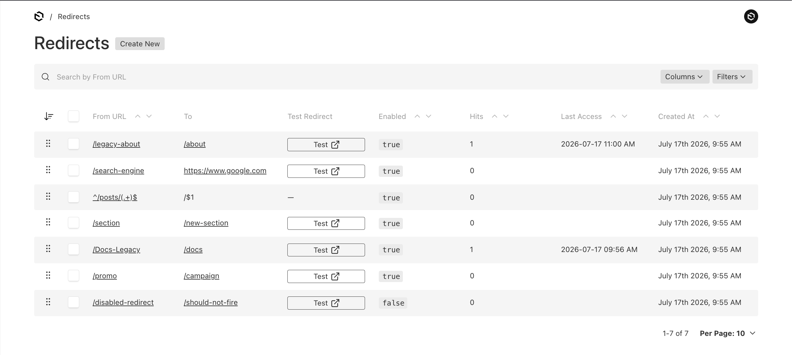
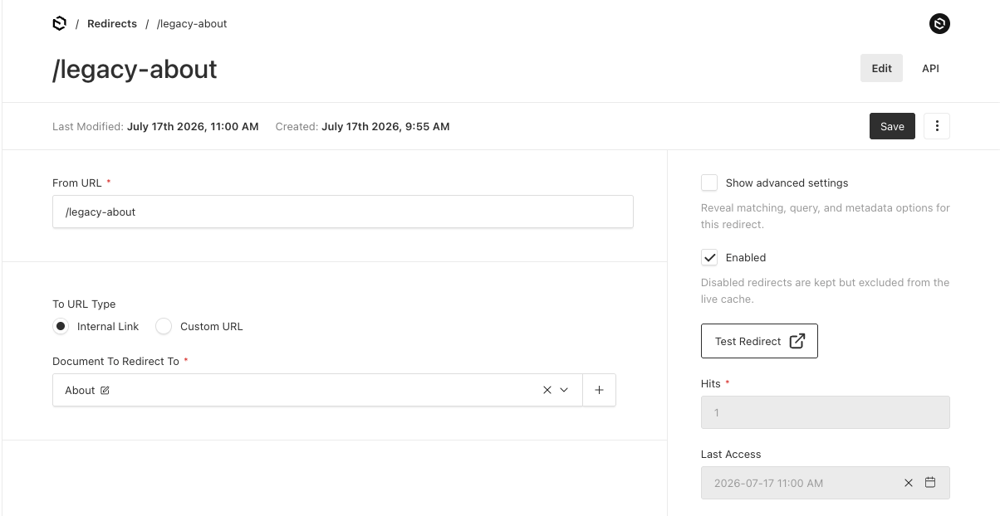
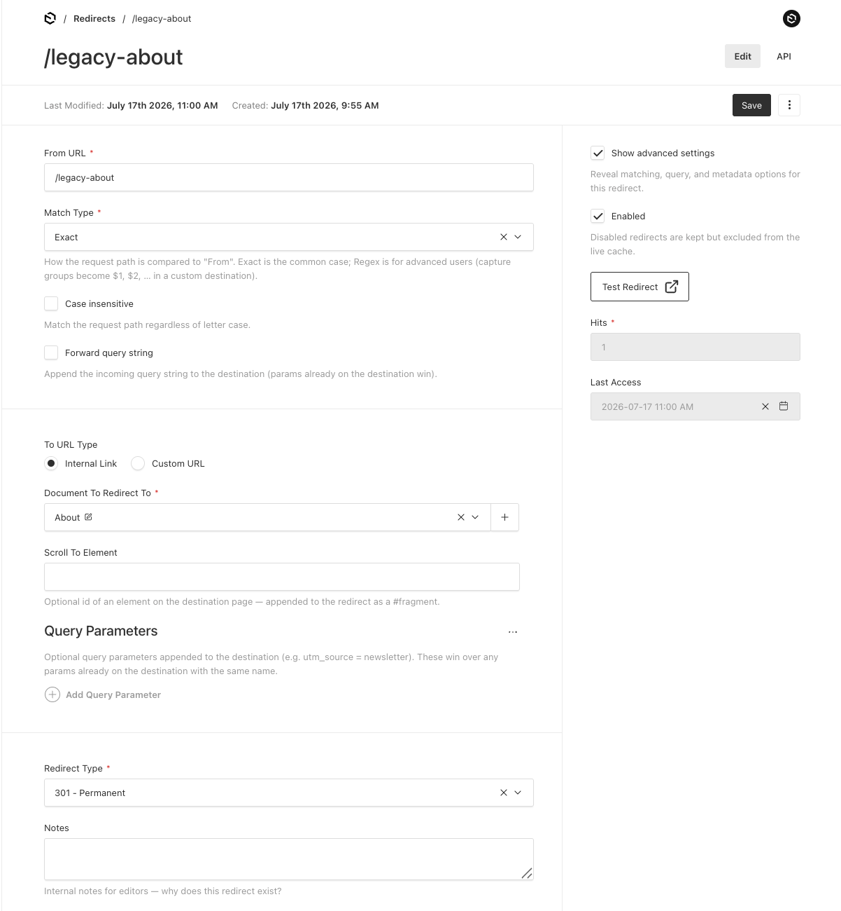

# @whatworks/payload-redirects

<a href="https://whatworks.com.au/?utm_source=github.com">
  <picture>
    <source media="(prefers-color-scheme: dark)" srcset="../../assets/blackbanner.svg">
    
  </picture>
</a>

&nbsp;

Managed redirects for [Payload](https://payloadcms.com) with a cache-backed [Next.js](https://nextjs.org) middleware matcher.

Editors manage redirects in an orderable admin collection; the plugin denormalizes them into a shared cache on every change; your `proxy.ts`/`middleware.ts` answers matching requests straight from that cache — no Payload import and no database query on a hit. A miss reads through to a CDN-cacheable list endpoint the plugin serves, so a cold region answers correctly on its first request instead of letting the visitor through. The serving side is framework-agnostic — a WHATWG-only resolver / request handler (`@whatworks/payload-redirects/resolver`) carries the same behavior to Hono, Cloudflare Workers, Astro, SvelteKit, Express, or anything else, and a pure `resolveRedirect` sits underneath for full manual control.

- **Simple by default, powerful when needed** — the editor form shows just `From`, `To`, and `Enabled`; a "Show advanced settings" toggle reveals match type, case-insensitivity, query forwarding, redirect type, scroll-to anchor, and notes.
- **Match types** — exact (default), starts with, ends with, contains, or regex with capture-group substitution (`^/blog/(.+)$` → `/news/$1`).
- **Internal or custom destinations** — point a redirect at a document (resolved to its path, kept in sync when the doc moves or is deleted) or at any URL/pathname.
- **Query forwarding & case-insensitivity** — opt-in per redirect.
- **Loop-safe** — save-time loop/self-redirect validation, and build-time chain flattening so visitors take a single hop.
- **Test in place** — a "Test Redirect" button on the edit form and a "Test Redirect" column in the list view open a redirect's `From` URL in a new tab.
- **Hit tracking** — per-redirect counter and last-access timestamp, updated in the background with adapter-agnostic optimistic concurrency.
- **Pluggable cache** — Vercel Runtime Cache, Vercel Edge Config, Redis (ioredis / node-redis / Upstash), Cloudflare KV, JSON file, in-memory, or your own adapter.
- **Localization & migration** — per-locale caches, and a one-shot helper to migrate from `@payloadcms/plugin-redirects`.

## Compared to `@payloadcms/plugin-redirects`

The official plugin gives you a redirects collection and leaves resolution to you — typically a database lookup on every request. This package keeps that familiar collection (and migrates from it in one step) but adds the serving layer it omits: matches are answered from a shared cache by an edge-safe middleware, with no `payload` import or database query on the hot path. It also goes past a single regex checkbox — five match types with capture-group substitution, drag-order precedence, loop protection, hit tracking, per-locale caches, and a framework-agnostic resolver for non-Next apps.

## Demo

Manage redirects from an orderable collection in the Payload admin, with quick testing and hit tracking:



Create simple redirects with an internal document or custom URL destination:



Reveal advanced matching, query, anchor, redirect type, and notes settings when needed:



## Install

```sh
pnpm add @whatworks/payload-redirects
# Only if you use a Vercel helper (`vercelRuntimeCache` / `vercelInvalidate`):
pnpm add @vercel/functions
# Only if you use the Vercel Edge Config adapter:
pnpm add @vercel/edge-config
```

`next`, `@vercel/functions`, and `@vercel/edge-config` are optional peer dependencies — install only what your chosen cache and matcher need.

## Quick start

Define the shared config once, in a module imported by **both** your Payload config and your middleware. `defineRedirectsConfig` bundles the `cache`, `list`, and any `endpointsPath`/`secret`/`api` so the two sides can never drift — spread it into the plugin, and pass it straight to the middleware:

```ts
// redirects.config.ts
import { envCache, fileCache } from '@whatworks/payload-redirects/cache'
import { defineRedirectsConfig } from '@whatworks/payload-redirects/middleware'
import { vercelInvalidate, vercelRuntimeCache } from '@whatworks/payload-redirects/vercel'

// `envCache` falls back to a JSON file cache locally, which is what makes
// `next dev` work. See "Development fallback".
export const redirectsConfig = defineRedirectsConfig({
  cache: envCache({
    development: fileCache(),
    production: vercelRuntimeCache(),
  }),
  // On Vercel one tag purge clears the runtime cache in every region AND the
  // CDN copies of the list route, so expiry no longer has to carry freshness.
  list: { invalidate: vercelInvalidate, maxAge: 60 * 60 * 24 * 365 },
})
```

No extra files: the plugin registers the CDN-cacheable list endpoint itself, and the serving side reads through to it on a miss. That is what keeps redirects correct when the proxy runs in a dozen regions and Payload writes from one — see [Serving from more than one region](#serving-from-more-than-one-region). `list.invalidate` is the only platform-specific piece; drop it and everything still works, bounded by `list.maxAge` instead.

```ts
// payload.config.ts
import { redirectsPlugin } from '@whatworks/payload-redirects'
import { redirectsConfig } from './redirects.config'

export default buildConfig({
  plugins: [
    redirectsPlugin({
      ...redirectsConfig, // cache, endpointsPath, secret — `api` is ignored here
      collections: {
        // Collections editors can pick as internal destinations, and how a
        // referenced doc resolves to the path it lives at.
        pages: { path: ({ doc }) => (doc.slug === 'home' ? '/' : `/${doc.slug}`) },
      },
    }),
  ],
})
```

```ts
// proxy.ts (Next 16) — or middleware.ts with the nodejs runtime
import type { NextFetchEvent, NextRequest } from 'next/server'
import { createRedirectsMiddleware } from '@whatworks/payload-redirects/middleware'
import { NextResponse } from 'next/server'
import { redirectsConfig } from './redirects.config'

const redirects = createRedirectsMiddleware(redirectsConfig)

export default async function proxy(request: NextRequest, event: NextFetchEvent) {
  return (await redirects(request, event)) ?? NextResponse.next()
}
```

> `defineRedirectsConfig` is exported from the main entry and from `/resolver` and `/middleware`. Import it from an **edge-safe** entry (`/middleware` above, or `/resolver`) whenever the shared module is also pulled into edge middleware — that keeps `payload` out of the middleware bundle.

## How it works

The plugin adds an orderable `redirects` collection. Every create/update/delete/reorder rebuilds the full redirect list — normalized `from`, resolved destination, `queryParams` and `scrollTo` fragment applied, flags denormalized — and writes it to the cache (if you configured one) in a single entry, then invalidates the list route's cache tags so other regions pick the change up. Collections configured as destinations get hooks too: when a published document's path changes (or it is deleted), the cache is rebuilt so resolved destinations never go stale. Draft saves never touch the cache.

The middleware reads the list per request, matches in admin drag order (first match wins), and issues the redirect. On a cache miss it **reads through** to the plugin's CDN-cacheable list endpoint: it fetches the list, answers the current request from it, and seeds the local cache. That costs the missing request one fetch (usually a CDN hit in its own region) rather than sending the visitor through unredirected — the trade that makes a multi-region read path correct, and the thing to understand before changing any of this. See [Serving from more than one region](#serving-from-more-than-one-region).

A broken cache backend never takes down routing: a throwing adapter is treated as a miss, so the request is still answered from the list route.

## The redirects collection

The editor form is deliberately minimal. By default only three controls show:

- **From URL** — what the request is matched against. For exact matches, a pathname (`/old`, trailing slashes collapsed) or absolute URL (reduced to its path + query). Unique (per locale when localized), indexed, validated.
- **To** — an internal document reference (when `collections` are configured) or a custom URL/pathname.
- **Enabled** (sidebar) — disabled redirects are kept in the collection but excluded from the live cache, so they never fire. Toggle a redirect off instead of deleting it.
- **Test Redirect** (sidebar) — opens the redirect's `From` URL in a new tab so you can confirm it fires. It reads the value currently in the field, so save first if you want to test an edit. Disabled when `From` isn't a concrete URL to open — a regex pattern, or a `contains`/`endsWith` fragment that isn't a path. Root-relative paths open against the admin's own origin. The list view carries the same action as a **Test Redirect** column.

Flip **Show advanced settings** (sidebar) to reveal:

- **Match Type** — `exact` (default) · `startsWith` · `endsWith` · `contains` · `regex`. Exact is the common case; regex is for advanced users, and capture groups substitute into a custom destination URL as `$1`, `$2`, … (unmatched groups become empty strings). Only regex supports substitution — the other types have a fixed destination. This replaces the old `useRegex` checkbox entirely.
- **Case insensitive** — match the request path regardless of letter case (regex uses the `i` flag).
- **Forward query string** — append the incoming query to the destination; params already present on the destination win.
- **Redirect Type** — `301` permanent (default) or `302` temporary. Also shown automatically whenever a redirect is already set to `302`.
- **Scroll To Element** — optional element id appended to the destination as `#fragment` (a leading `#` is tolerated; it replaces any fragment a custom URL already carries).
- **Query Parameters** — an optional list of `name` / `value` rows appended to the destination's query string (e.g. `utm_source` = `newsletter`). Names and values are URL-encoded for you; a row wins over a param already on the destination with the same name. Any fragment (from **Scroll To Element** or a custom URL) is preserved after the query.
- **Notes** — free-text, editor-facing ("why does this redirect exist?").

Advanced-gated fields stay visible for any redirect that already holds a non-default value, so a redirect configured through the toggle keeps showing its options even after the toggle is turned off.

Rows are drag-orderable; earlier rows win when several match. Redirects that cannot produce a working redirect (unresolvable reference, empty destination, unparseable `from`) are dropped from the cache rather than cached broken.

### Match-type & regex safety

Regex patterns are validated at save time (this is a conservative static check, not a runtime ReDoS guard — exotic patterns may need restructuring). The validator rejects:

- patterns that don't compile, or are longer than 256 characters;
- backreferences (`\1`–`\9`);
- nested unbounded quantifiers — an unbounded quantifier (`*`, `+`, `{n,}`) wrapping a group that itself repeats unboundedly, i.e. the classic catastrophic-backtracking shape `(a+)+`;
- bounded repetition with a maximum above 1000.

`validateSafeRegexPattern`, `validateFromField`, `validateUrlOrPathname`, `validateScrollTo`, and `validateQueryParamKey` are exported if you build your own fields.

### Canonicalization

Exact `from` values (and the request targets they're compared against) are canonicalized with identical logic so equivalent URLs match:

- absolute URLs are reduced to `path(+search)`, and trailing slashes are collapsed;
- query strings are sorted by key (stable for repeated keys), so `?b=2&a=1` ≡ `?a=1&b=2`;
- raw unicode is percent-encoded and all `%xx` escapes are upper-cased.

Case is **preserved** during canonicalization — case-insensitivity is a per-redirect match-time concern. Non-exact match types (starts with / ends with / contains / regex) are only trimmed, never canonicalized, since stripping a trailing slash would break the intent of a substring or pattern. The matcher tries `path?search` first (most specific), then the bare path, so `/old` still matches `/old/?utm_source=x`.

### Loops & chains

- **Save time** — creating or editing an exact redirect with a custom relative destination is checked against the graph of existing enabled exact redirects; a direct self-redirect, or a chain that leads back to the redirect's own `from` within 20 hops, is rejected with a `ValidationError` that spells out the chain. (Reference destinations and non-exact match types are out of scope.)
- **Build time** — when the cache is built, each entry's destination is followed through exact entries (up to 10 hops) and collapsed, so `/a → /b` + `/b → /c` is cached as `/a → /c` and visitors take a single hop. A cycle is logged and left unflattened rather than cached broken. The earliest `scrollTo` fragment in the chain is carried onto the final destination.

## Plugin options

```ts
redirectsPlugin({
  cache, // optional store in front of the list route — see "Cache adapters"
  collections: {
    // internal-destination collections (omit for custom URLs only)
    pages: {
      path: ({ doc, locale, req }) => string | null | undefined,
      // Runs at cache-build time with the referenced doc populated one level
      // deep. Return null/undefined (or throw) to drop redirects pointing at
      // this doc. `locale` is passed when the plugin is localized.
      select: { slug: true, title: true }, // optional — see below
    },
  },
  slug: 'redirects', // collection slug
  endpointsPath: '/payload-redirects', // REST base path (must match the middleware option)
  trackHits: true, // hit counter + lastAccess fields and the hit endpoint
  localized: false, // localize `from` and `to`; build one cache per locale
  syncOnInit: true, // rebuild the cache from the database once on boot (onInit)
  secret: process.env.REDIRECTS_SECRET, // lock down the endpoints — see "Security"
  disabled: false, // keep the collection (schema parity) but disable everything else
  overrides: ({ collection }) => collection, // final say over the generated collection
})
```

- **`select`** (per destination collection) narrows the fields populated on that collection during a cache rebuild — passed to the redirects `find` as `populate: { [slug]: select }`, so depth-1 population fetches only what your `path()` needs. Defaults to full population.
- **`localized`** localizes `from` and the `to` group, and builds the cache once per configured locale (each cache entry carries its `locale`). Requires `localization` on the Payload config — if absent, the plugin logs a warning and behaves as `false`. Rows with no `from` for a given locale are skipped for that locale. Unique `from` is scoped per locale.
- **`syncOnInit`** rebuilds the cache from the database once on boot, composing any existing `onInit` (yours runs first). A freshly started instance then serves redirects without waiting for the first content change or cache-miss refresh. A sync failure is logged, never fatal. Set `false` to opt out; skipped entirely when `disabled`.
- **`list`** configures the CDN-cacheable list route both halves share — `maxAge`, `staleWhileRevalidate`, `tags`, `invalidate`, and `disabled` are plugin-side, `path` and `disabled` are serving-side. See [Serving from more than one region](#serving-from-more-than-one-region).
- **`api`** and **`cacheMemoMs`** come from the shared config but are **ignored by the plugin** — they only concern the middleware/resolver. Spreading `redirectsConfig` into both sides is safe.

`syncRedirectsCache(payload, req?, options?)` is exported for priming the cache from seed scripts — it rebuilds, writes, and then calls `list.invalidate`; pass `{ invalidate: false }` when nothing actually changed. `getRedirectsConfig(config)` returns the resolved plugin config from a Payload config.

### Security (endpoint hardening)

By default the `refresh-cache` and `hit/:id` endpoints are open (zero-config — the middleware calls them itself, and they only rewrite the cache or bump a counter from existing data). Set a `secret` to lock them down: both endpoints then require either an authenticated `req.user` or the `x-payload-redirects-secret` header equal to that value; unauthorized requests get a `403`. Give the middleware the same `secret` and it sends the header on its background refresh and hit-tracking requests. When `NODE_ENV === 'production'` and no `secret` is set, the plugin logs a one-time warning on boot that the endpoints are publicly reachable.

`secret` covers only those two write endpoints — neither of which can create, edit, or delete a redirect, so the exposure without one is wasted rebuilds and polluted hit counters, not tampering. It deliberately does **not** gate `GET …/list`: a CDN cache key excludes request headers, so a gated-but-cached response is handed to whoever asks next anyway. The serving side still sends the header on its list fetch, so a route **you** own via `list.path` can check it.

### Hit tracking

With `trackHits: true` (default), each match reports to `POST /hit/:id` in the background. The write uses adapter-agnostic optimistic concurrency: it reads the current count, then issues a guarded update conditioned on that value, retrying up to three times on a lost race before a best-effort unguarded write. Same-id writes are also serialized per process. It's designed to be as close to atomic as the database API allows — accurate enough for analytics, not accounting.

## Middleware options

```ts
createRedirectsMiddleware({
  cache, // optional store in front of the list route — same adapter as the plugin
  api: '/api', // Payload REST base: relative path (default) or absolute URL — see below
  endpointsPath: '/payload-redirects',
  list: undefined, // the read-through origin — see "Serving from more than one region"
  cacheMemoMs: undefined, // in-memory memo; bounds edit propagation (default 5000 in production)
  trackHits: true, // report matches to the hit endpoint (disable with trackHits: false)
  refreshOnMiss: true, // fallback only, for when the list route is unreachable
  secret: process.env.REDIRECTS_SECRET, // sent as x-payload-redirects-secret on background calls
  debug: false, // console.debug('[payload-redirects] …') for misses, matches, skips
  trailingSlash: false, // match your next.config trailingSlash: true
  onRedirect: ({ destination, redirect, request }) => {
    // Called for every issued redirect via event.waitUntil when available, else
    // fire-and-forget. Errors are swallowed — a failing hook never breaks routing.
  },
})
```

- **`cache`** — **optional.** A store in front of the list route: a hit answers with no HTTP hop at all. Omit it and the serving side runs on the list route alone, which is correct (just a fetch per memo expiry) — a store is never the source of truth, `list` is. Sharing one adapter with the plugin means its writes warm the store directly, which is what you want in a single deployment; it is no longer a requirement, because the read-through seeds whatever store the serving side has. That is what makes a store the writer cannot reach — a Worker's KV binding, a per-instance `memoryCache()` — a sensible choice.
- **`list`** — the read-through origin. On a miss the resolver fetches the list from `list.path`, answers the current request from it, and seeds `cache` — which is what makes a multi-region read path correct (see [Serving from more than one region](#serving-from-more-than-one-region)). `path` defaults to the plugin's own list endpoint, derived from `api` and `endpointsPath`, so there is nothing to set; a relative path is `basePath`-prefixed and resolved against the request origin exactly like `api`, an absolute URL is used verbatim. `list: { disabled: true }` stops the plugin registering the endpoint; combined with a `path` it means "I serve the list myself", and on its own it means "there is no list route", which restores the legacy miss path.
- **`refreshOnMiss`** — the fallback when the list is disabled or the list route is unreachable. It POSTs `refresh-cache`, which rebuilds wherever the Payload function runs — so on a multi-region read path it warms a cache the missing region cannot see, and the current request still passes through unredirected. The read-through is the real mechanism; this is a weak backstop.
- **`api`** — base of the Payload REST API the background refresh and hit-tracking calls target. A **relative path** (default `/api`) is resolved against each request's own origin and, in an app with a `basePath`, prefixed with it automatically — so keep it `/api`, not `/<basePath>/api`. An **absolute URL** (`https://cms.example.com/api`) is used verbatim, for split-origin deployments (see below), and is never `basePath`-prefixed.
- **`cacheMemoMs`** — micro-memo (per middleware instance) of the last resolved list, whether it came from `cache` or from a read-through, so bursts of requests don't each hit the backing store. Defaults to `5000` when `NODE_ENV === 'production'`, otherwise `0` (off). A miss is never memoized, so a fresh list is picked up on the very next request. **This is the only layer no purge can reach**, which makes it the floor on how quickly an edit is seen: keep it at the few-second default when `cache` is set, and raise it (`60_000`) when it is not, trading propagation delay for fewer fetches.
- **`debug`** — opt-in diagnostics for cache misses, matches (`from → destination` + status), open-redirect rejections, and self-redirect skips. Never logs request bodies.
- **`trailingSlash`** — set to `true` when your `next.config` uses `trailingSlash: true`. Relative destinations then get a trailing slash on the path part (`/about` → `/about/`), so we redirect straight to the canonical URL instead of letting Next 308 the slashless one — a wasteful double hop. The slash is skipped when the path is `/`, already ends with `/`, or its last segment looks like a file (`/logo.png`), mirroring Next's own exemption; query and fragment are preserved (`/a?x=1#f` → `/a/?x=1#f`). Absolute/external destinations are never touched. Not auto-detected — `NextRequest` exposes no reliable view of the app's `trailingSlash` config — so set it explicitly.
- **`onRedirect`** — a side-effect hook (custom analytics, logging) that runs off the hot path.

The returned function takes `(request, event?)` and resolves to a `NextResponse` redirect or `undefined`. Background work runs through `event.waitUntil` when an event is passed.

### Next.js `basePath`

Apps with a [`basePath`](https://nextjs.org/docs/app/api-reference/config/next-config-js/basePath) just work — no configuration needed. Redirect entries are authored **without** the basePath (`/old`, not `/base/old`): matching runs against the basePath-stripped request path, and the basePath is re-applied to relative destinations, so `/base/old` → `/base/new`. Absolute/external destinations are left as-is. The background refresh and hit-tracking calls also target the basePath-prefixed Payload API, so leave `api` as its plain relative value (e.g. `/api`) — the basePath is prepended for you.

## Other frameworks

The Next.js middleware is a thin wrapper over a framework-agnostic core exported from `@whatworks/payload-redirects/resolver`. That core speaks only WHATWG APIs (`fetch`, `URL`, `Request`, `Response`) and imports no `payload`, `next`, or Node built-ins, so it stays bundleable on any edge/worker runtime. It carries **the same operational behavior as the middleware** — the in-process memo, ordered matching, `forwardQuery`, `trailingSlash`, read-through to the list route on a miss, hit tracking, the `secret` header, and `debug` logging — so any runtime serves redirects identically. Two factories:

- **`createRedirectsResolver(options)`** → `(url, ctx?) => Promise<{ destination, redirect, status } | null>`. `destination` is relative or absolute exactly as resolved (after `forwardQuery`/`trailingSlash`); you absolutize and respond however your framework does. `url` is a `string | URL`.
- **`createRedirectsRequestHandler(options)`** → `(request, ctx?) => Promise<Response | null>`. Answers a WHATWG `Request` with a `Response.redirect` (relative destinations absolutized against `request.url`), or `null` to pass through.

Pass `ctx.waitUntil` (Vercel/Cloudflare `waitUntil`, Next's `event.waitUntil`, …) to anchor the background refresh / hit-tracking work; without it, that work runs fire-and-forget. Both factories accept the same options as the middleware **minus the Next-only `basePath` behavior**: `cache` (optional), `list`, `api`, `endpointsPath`, `secret`, `trackHits`, `refreshOnMiss`, `trailingSlash`, `cacheMemoMs`, `debug`, and `onRedirect({ destination, redirect, url })`.

### Split-origin deployments (an absolute `api`)

This is the usual non-Next shape: Payload (which serves the REST API, and therefore the list route) on one origin, your Hono/Worker/SvelteKit app serving redirects on another. Set `api` to the absolute Payload API base, no trailing slash — every endpoint URL, including the list route, is then derived from it and the request origin is ignored:

```ts
createRedirectsRequestHandler({ api: 'https://cms.example.com/api' })
// → list:    https://cms.example.com/api/payload-redirects/list
// → refresh: https://cms.example.com/api/payload-redirects/refresh-cache
// → hit:     https://cms.example.com/api/payload-redirects/hit/:id
```

**The two deployments no longer need to share a store.** `cache` is optional, and the list route is the source of truth — so all the serving side needs is the CMS origin. That used to require infrastructure both halves could reach (a globally-replicated Redis, or Edge Config), because the plugin wrote to a store and the serving side read from it. Now they share a URL. Add a `cache` back when you want to skip the fetch on a hit; anything the serving runtime can read works, since the read-through seeds it locally rather than relying on the plugin to write it.

What still has to agree across the two deployments: **`endpointsPath`** (both sides build the same URLs from it) and **`secret`** (the serving side sends it, the plugin checks it on `refresh-cache`/`hit`). `list.tags` and `list.invalidate` are plugin-side only; `list.path` is serving-side only.

> **Off Vercel, expect the memo to do the work.** The list response carries `CDN-Cache-Control: public, max-age=60, stale-while-revalidate=86400` for CDNs, but a deliberately conservative `Cache-Control: public, max-age=0, must-revalidate` for everything else — so a plain HTTP client cache in front of that `fetch` will not hold it. Whether you get shared caching depends on the CDN in front of your Payload deployment honouring the targeted header. `cacheMemoMs` is what bounds the fetch rate regardless, which is why it is worth raising when you run without a `cache`.

The Next.js middleware treats an absolute `api` the same way (it then skips the `basePath` prefix on endpoint URLs).

> `fileCache`'s default path is `.next/cache/payload-redirects.json`, a Next convention — non-Next apps should pass an explicit `path` (e.g. `fileCache({ path: '.cache/payload-redirects.json' })`).

### Recipes

```ts
// Hono — no store at all: the list route plus the memo
import { createRedirectsRequestHandler } from '@whatworks/payload-redirects/resolver'

const redirects = createRedirectsRequestHandler({
  api: 'https://cms.example.com/api',
  cacheMemoMs: 60_000,
})

app.use(async (c, next) => {
  const response = await redirects(c.req.raw, c.executionCtx)
  return response ?? next()
})
```

```ts
// Cloudflare Workers — KV as a local accelerator, seeded by the read-through
import { cloudflareKVCache } from '@whatworks/payload-redirects/cache'
import { createRedirectsRequestHandler } from '@whatworks/payload-redirects/resolver'

let redirects // module scope persists across requests, keeping the memo warm

export default {
  async fetch(request, env, ctx) {
    redirects ??= createRedirectsRequestHandler({
      api: 'https://cms.example.com/api',
      // The plugin never writes this KV namespace — it cannot reach a Worker
      // binding. The resolver seeds it after reading the list, which is exactly
      // why a store the writer can't see is now useful.
      cache: cloudflareKVCache({ namespace: env.REDIRECTS }),
    })
    return (await redirects(request, ctx)) ?? fetch(request)
  },
}
```

```ts
// Astro — src/middleware.ts
import { createRedirectsRequestHandler } from '@whatworks/payload-redirects/resolver'
import { defineMiddleware } from 'astro:middleware'
import { cache } from './redirects-cache'

const redirects = createRedirectsRequestHandler({ cache })

export const onRequest = defineMiddleware(async (context, next) => {
  return (await redirects(context.request)) ?? next()
})
```

```ts
// SvelteKit — src/hooks.server.ts
import { createRedirectsRequestHandler } from '@whatworks/payload-redirects/resolver'
import { cache } from './redirects-cache'

const redirects = createRedirectsRequestHandler({ cache })

export const handle = async ({ event, resolve }) =>
  (await redirects(event.request)) ?? resolve(event)
```

```ts
// Express — the resolver with Node req/res
import { createRedirectsResolver } from '@whatworks/payload-redirects/resolver'
import { cache } from './redirects-cache'

const resolve = createRedirectsResolver({ cache })

app.use(async (req, res, next) => {
  const url = new URL(req.originalUrl, `${req.protocol}://${req.get('host')}`)
  const result = await resolve(url)
  return result ? res.redirect(result.status, result.destination) : next()
})
```

### The pure matcher (`resolveRedirect`)

Under the resolver sits `resolveRedirect`, which is pure and dependency-free — reach for it when you want full manual control (custom hit reporting, no background fetch). It owns ordered matching, the self-redirect skip (fragments ignored, since they never reach the server), and the **open-redirect guard**: when a stored `to` is relative, the final destination (after regex substitution) must be a plain absolute path — it may not begin with `//` or `/\`, which browsers treat as protocol-relative URLs to another origin. `forwardQuery` is applied separately (it needs the full request URL), via the exported `mergeForwardedQuery`.

```ts
import { mergeForwardedQuery, resolveRedirect } from '@whatworks/payload-redirects'
import { cache } from './redirects-cache'

const entries = await cache.get()
const resolved = entries && resolveRedirect(entries, req.url)
if (resolved) {
  const { redirect } = resolved
  const destination = redirect.forwardQuery
    ? mergeForwardedQuery(resolved.destination, new URL(req.url, 'http://x').search)
    : resolved.destination
  // respond with a `redirect.status` (301/302) redirect to `destination`, report the hit yourself
}
```

`resolveRedirect(redirects, url, options?)` accepts a `string | URL` and returns `{ destination, redirect } | null`. Its optional `options.onSkip({ destination, reason, redirect })` fires for every **matched** entry that a guard then skips (`reason` is `'open-redirect'` or `'self-redirect'`), so you can answer "why didn't my redirect fire?" without re-implementing the guards; plain non-matches never fire it. The resolver and middleware wire `onSkip` to their `debug` logging. Report hits yourself with `POST {api}{endpointsPath}/hit/:id` if you want the counter.

## Cache adapters

A cache is just:

```ts
interface RedirectsCache {
  get: () => Promise<CachedRedirect[] | null> // null = miss
  set: (redirects: CachedRedirect[]) => Promise<void>
}
```

Two callers reach `set`: the plugin, when redirects change, and the serving side, when it seeds a store after a read-through. An adapter cannot tell them apart, so **`set` must never purge anything** — a purge there would fire on every read and invalidate the copy the resolver had just fetched. Invalidation lives on `list.invalidate`, which only the write path calls.

| Adapter                        | Import                                     | Use                                                                                                                                                                            |
| ------------------------------ | ------------------------------------------ | ------------------------------------------------------------------------------------------------------------------------------------------------------------------------------ |
| `vercelRuntimeCache(options?)` | `@whatworks/payload-redirects/vercel`      | **Recommended on Vercel.** A hit is answered inside the function with no HTTP hop. Per-region and ephemeral, which the read-through makes harmless — see below.                |
| `edgeConfigCache(options)`     | `@whatworks/payload-redirects/edge-config` | Vercel deployments wanting the lowest-latency read path — see below. Reads via `@vercel/edge-config`; writes go through the Vercel REST API. Wrap with `envCache` for dev.     |
| `redisCache(options)`          | `@whatworks/payload-redirects/cache`       | Any Redis — ioredis, node-redis v4, or `@upstash/redis`. Pass your existing client; no dependency is added.                                                                    |
| `cloudflareKVCache(options)`   | `@whatworks/payload-redirects/cache`       | Cloudflare Workers/Pages. Pass the KV namespace binding.                                                                                                                       |
| `fileCache({ path? })`         | `@whatworks/payload-redirects/cache`       | Development and single-server self-hosting. Atomic JSON file writes; bridges the separate module graphs `next dev` runs the middleware and server in. Requires a Node runtime. |
| `memoryCache()`                | `@whatworks/payload-redirects/cache`       | Tests, a single long-lived process serving both sides, or a per-instance accelerator seeded by the read-through. The plugin's writes are invisible across processes.           |
| `envCache(options)`            | `@whatworks/payload-redirects/cache`       | Not a store — composes two caches and picks one per environment (e.g. file cache in dev, runtime/edge cache in prod). See "Development fallback".                              |

Any object with `get`/`set` works as an adapter — plug in your own store.

### Development fallback (`envCache`)

Cloud read paths like the Vercel Runtime Cache and Edge Config don't exist on your machine, so a `next dev` session needs a local stand-in (typically a `fileCache()`, which bridges the separate module graphs `next dev` runs the proxy and server in). `envCache` makes that fallback **explicit at the call site** — it composes two caches and selects one **once, at construction**:

```ts
import { envCache, fileCache } from '@whatworks/payload-redirects/cache'
import { vercelRuntimeCache } from '@whatworks/payload-redirects/vercel'

export const cache = envCache({
  development: fileCache(), // default when omitted; used when select() → 'development'
  production: vercelRuntimeCache(), // used when select() → 'production'
})
```

Previously each Vercel adapter carried a hidden `development` option and silently swapped stores based on `NODE_ENV`. `envCache` replaces that: the fallback lives where you define the cache, not inside the adapter.

- **Lazy branches** — pass a branch as a thunk and it's only built if selected, so `production: () => redisCache({ client: makeRedis() })` never opens a Redis connection during local dev. Plain instances (as above) also work.
- **`select`** — defaults to `NODE_ENV === 'development' ? 'development' : 'production'`. Override it when `NODE_ENV` lies — e.g. Vercel preview deployments run with `NODE_ENV === 'production'` but you may still want the file cache:

  ```ts
  envCache({
    development: fileCache(),
    production: edgeConfigCache({ edgeConfigId: 'ecfg_xxx', token: process.env.VERCEL_API_TOKEN! }),
    select: () => (process.env.VERCEL_ENV === 'production' ? 'production' : 'development'),
  })
  ```

When the development branch engages it logs a one-line notice so the switch is discoverable; production is silent.

### Serving from more than one region

This is the one thing worth understanding about redirect serving, because getting it wrong fails intermittently rather than loudly.

**Redirect serving is multi-region. Redirect writing is not.** Routing middleware runs in whichever region is nearest the visitor — on Vercel that is true in the Node runtime as well, since the runtime setting controls the sandbox, not the placement. The Payload function that writes the cache runs only in your project's function region. So a **region-scoped cache is written in one place and read from many**, and every other region reads an empty cache.

Left alone it does not self-heal. A miss would POST `refresh-cache`, which rebuilds in the _writing_ region again — so the region that missed stays cold, the visitor gets no redirect, and you pay for a full rebuild that helps nobody. Measured on a real deployment before this was fixed: twelve reading regions, one writing region, a 26–42% hit rate, and roughly one wasted rebuild per read, with the same URL serving a 301 and a 404 within the same hour.

**The fix is a read-through, and it is on by default.** The plugin registers `GET {endpointsPath}/list` — the redirect list built fresh from the database, under long-lived shared-cache headers and a purgeable cache tag. On a cache miss the resolver fetches it, **answers the current request from it**, and seeds the local cache. A cold region serves the right redirect on its very first request, then stops missing. Correctness lives at the origin; the cache is only ever an accelerator.

Nothing to configure — `list.path` defaults to that endpoint, derived from `api` and `endpointsPath`, and it works on any platform with or without a `cache`.

**Freshness, and why the default TTL is short.** The list is served with `max-age=60, stale-while-revalidate=86400`: after a minute a shared cache answers instantly from its expired copy and refreshes behind the request, so no visitor waits on the origin and the origin sees at most one request per PoP per window. A _long_ TTL is only correct when something purges the tag — and purging is platform-specific, so the package cannot assume it exists. Defaulting to a year would mean that anywhere without a purge wired up, **an edit would never propagate**. Short expiry is the floor that is correct everywhere.

**On Vercel you can do better.** Wire up `list.invalidate` and hand freshness to the purge instead of to expiry:

```ts
import { vercelInvalidate } from '@whatworks/payload-redirects/vercel'

defineRedirectsConfig({
  cache,
  list: { invalidate: vercelInvalidate, maxAge: 60 * 60 * 24 * 365 },
})
```

`invalidate` is called once per cache write — never by the read-through — so it is safe for it to be a real purge. On Vercel a tag purge clears the **CDN, Runtime, and Data caches together, in every region**, propagating globally in roughly 300ms, and it marks entries stale rather than deleting them: the next request is answered instantly from the stale copy while revalidation happens behind it. One call therefore invalidates both cached layers — the CDN copies of the list route _and_ every region's `vercelRuntimeCache` entry — which is why `list.tags` is the single source of truth for the tag both of them carry.

The origin then sees roughly one request per region per edit. Off Vercel, either keep the short TTL or point `invalidate` at your own CDN's purge API.

**`cacheMemoMs` is the other half of propagation**, on every platform: no purge can reach into a running instance's memory, so an edit takes up to the memo window to be seen. That makes the memo — not either cache — the floor on freshness.

Opt out with `list: { disabled: true }` and no `path` — no endpoint, no read-through — when the reader and writer genuinely share one region — a single self-hosted Node server — or when you use a **globally readable** store: `edgeConfigCache`, a globally-replicated `redisCache`, or `cloudflareKVCache` inside a Worker.

> **The list endpoint is public.** It returns every enabled redirect's `from` and resolved destination, and it is deliberately not secret-gated even when `secret` is set: a CDN cache key does not include request headers, so a gated-but-cached response would be handed to unauthenticated callers anyway. That list is discoverable by probing your site regardless, so for almost every site this is a non-issue. If it is one for yours, disable it and use a globally readable store instead.

The whole layer is one config block, read by both halves:

```ts
defineRedirectsConfig({
  cache,
  list: {
    disabled: false, // true → don't register the endpoint (see "Owning the list route yourself")
    invalidate: undefined, // purge hook; `vercelInvalidate` on Vercel
    maxAge: 60, // default — raise it once something purges the tag
    path: undefined, // defaults to the plugin's own endpoint
    staleWhileRevalidate: 60 * 60 * 24, // default
    tags: ['payload-redirects'], // default; set on the response AND passed to invalidate
  },
})
```

### Owning the list route yourself

Point `list.path` anywhere and serve the same payload from your own handler — for per-environment cache headers, or an auth gate you accept the CDN implications of. Both pieces are exported from the package root, so this works on any framework that can return a `Response`, not just Next.js:

```ts
// app/api/redirects-list/route.ts — or a Hono/SvelteKit/Astro handler
import config from '@payload-config'
import {
  buildRedirectsCacheEntries,
  getRedirectsConfig,
  listResponseHeaders,
} from '@whatworks/payload-redirects'
import { getPayload } from 'payload'

export const GET = async () => {
  const payload = await getPayload({ config })
  const resolved = getRedirectsConfig(payload.config)
  const redirects = await buildRedirectsCacheEntries({ config: resolved, payload })
  // Reuse the resolved `list` settings rather than restating them, so the tag
  // this response carries can never drift from the tag `invalidate` purges.
  return Response.json({ redirects }, { headers: listResponseHeaders(resolved.list) })
}
```

```ts
defineRedirectsConfig({ cache, list: { disabled: true, path: '/api/redirects-list' } })
```

`disabled: true` stops the plugin registering its own endpoint; `path` still tells the serving side where to read through to, so the read-through keeps working. Note this is only ever about control: Payload passes a custom endpoint's response headers through untouched (`handleEndpoints` merges them over its own and only adds CORS), so the built-in endpoint caches exactly as well.

### Vercel Runtime Cache

The recommended store on Vercel: a hit is answered from inside the function with no HTTP hop at all, and the list route sits behind it as the origin.

> **Not a store of record.** The runtime cache is **per-region** (each Vercel region has its own isolated copy) and **ephemeral** (entries are subject to LRU eviction against a project-wide storage limit, whatever TTL you request, with no `stale-while-revalidate` equivalent — an expired or evicted entry is a hard miss). None of that matters behind the read-through, which is on by default: a cold region is correct on its very first request. It matters a great deal with `list: { disabled: true }` — see [Serving from more than one region](#serving-from-more-than-one-region).

```ts
import { envCache, fileCache } from '@whatworks/payload-redirects/cache'
import { vercelRuntimeCache } from '@whatworks/payload-redirects/vercel'

export const cache = envCache({
  development: fileCache({ path: '.next/cache/payload-redirects.json' }),
  production: vercelRuntimeCache({
    key: 'payload-redirects',
    tags: ['payload-redirects'],
    ttl: 60 * 60 * 24 * 365, // the runtime cache treats entries without a TTL as never fresh
  }),
})
```

The TTL defaults to a year because hooks re-sync on every change and `list.invalidate` purges every region, so expiry is not relied on for correctness. Note that a long TTL does not protect against eviction. Keep `tags` equal to `list.tags` — that is what the purge is handed, and a mismatch silently stops it clearing this layer. Both default to `payload-redirects`.

### Vercel Edge Config

Edge Config is the ideal read path on Vercel: reads are ultra-low-latency and available in middleware without invoking a function. Writes go through the Vercel REST API (they need an API token and are rate-limited), which is exactly right for write-rarely data like a redirect list. To avoid burning an API write on every local save, wrap it with `envCache` so development uses a `fileCache()` (see "Development fallback").

```ts
import { envCache, fileCache } from '@whatworks/payload-redirects/cache'
import { edgeConfigCache } from '@whatworks/payload-redirects/edge-config'

export const cache = envCache({
  development: fileCache(),
  production: edgeConfigCache({
    connectionString: process.env.EDGE_CONFIG, // default: process.env.EDGE_CONFIG (used for reads)
    edgeConfigId: 'ecfg_xxx', // used in the write URL
    token: process.env.VERCEL_API_TOKEN!, // Vercel API token with write access
    teamId: process.env.VERCEL_TEAM_ID, // required when the store belongs to a team
    itemKey: 'payload-redirects',
  }),
})
```

A failed write throws (with the status and response body) so a redirect save fails loudly, matching the plugin's other cache-write hooks.

### Redis (ioredis / node-redis / Upstash)

```ts
import { redisCache } from '@whatworks/payload-redirects/cache'
import { Redis } from 'ioredis' // or 'redis' (node-redis v4), or '@upstash/redis'

export const cache = redisCache({
  client: new Redis(process.env.REDIS_URL!),
  key: 'payload-redirects',
})
```

The list is stored as a JSON string. On read the adapter accepts either a JSON string (ioredis, node-redis) or an already-parsed array (`@upstash/redis` auto-deserializes), so any of the three clients works unchanged.

On a multi-region read path, make sure the database is **globally replicated** (Upstash calls these global databases with read regions). A single-region Redis is correct everywhere — unlike a region-scoped cache — but every foreign region pays a cross-continent round trip on the redirect hot path. Either replicate it or keep the list route in front of it.

### Cloudflare KV

```ts
import { cloudflareKVCache } from '@whatworks/payload-redirects/cache'

// In your Worker/Pages handler, with the KV binding from env:
const cache = cloudflareKVCache({ namespace: env.REDIRECTS, key: 'payload-redirects' })
```

## Migrating from `@payloadcms/plugin-redirects`

The official plugin's shape is nearly identical (`from` text; `to.type` custom|reference, `to.reference`, `to.url`). Swap it for this plugin on the **same collection slug**, then run the migration helper once — it iterates every redirect and re-saves any that still needs it, backfilling `type: '301'`, `matchType: 'exact'`, and `enabled: true`, normalizing `from`, and populating the cache. Docs already complete are skipped; per-doc failures are collected and returned, never thrown.

```ts
import { migrateFromOfficialRedirects } from '@whatworks/payload-redirects'

const { updated, skipped, errors } = await migrateFromOfficialRedirects({ payload })
console.log(`Migrated ${updated}, skipped ${skipped}, ${errors.length} errors`)
```

Run it from a one-off script or a `payload.jobs`/migration task, then remove the call.

## Endpoints

Registered under the Payload API route at `endpointsPath`:

- `POST /api/payload-redirects/refresh-cache` — rebuild the cache from the database.
- `GET /api/payload-redirects/list` — the redirect list, CDN-cacheable and purgeable by tag, that the serving side reads through to on a miss. Registered unless `list: { disabled: true }`.
- `POST /api/payload-redirects/hit/:id` — increment a redirect's hit counter (only when `trackHits` is enabled).

The two `POST` endpoints are open unless you configure a `secret` (see [Security](#security-endpoint-hardening)). The list endpoint is **never** secret-gated — see [Serving from more than one region](#serving-from-more-than-one-region) for why.

## Failure semantics

- Hooks on the **redirects collection** propagate cache-write failures — a redirect an editor believes is live but never reached the cache is worse than a failed save.
- Hooks on **destination collections** only log failures — a broken cache backend must not block content publishing.
- The **serving side** treats a throwing cache adapter as a miss rather than as "no redirects", so a misconfigured store degrades to the list route instead of silently disabling every redirect. It never seeds a store that is already failing.
- A **failed list fetch** falls back to `refreshOnMiss` and passes the request through — that is the only path on which a miss still goes unredirected.
- A **failed `list.invalidate`** is logged and swallowed: stale entries then expire on their own TTL, which is a freshness problem, not a correctness one, and it must not fail the write that triggered it.
